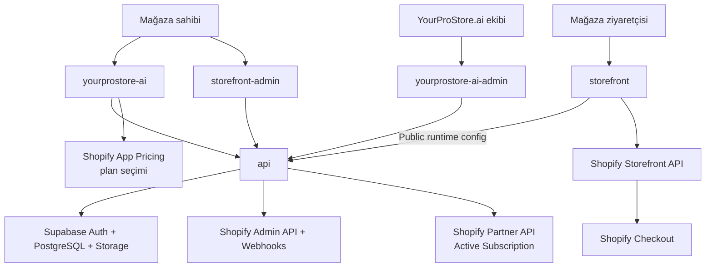
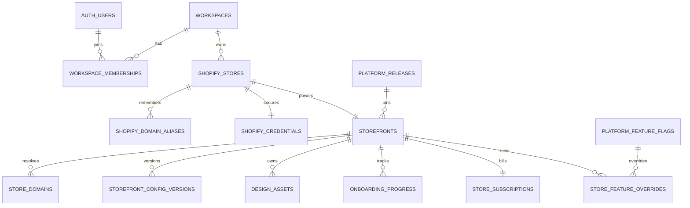
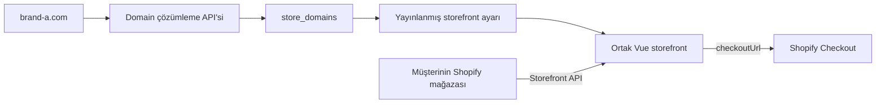

# YourProStore.ai sistem mimarisi

## Değişiklik disiplini

Daha önce çalışan veya bilinçli olarak tasarlanmış bir akış, görünen bir deployment
hatasını geçici olarak aşmak amacıyla değiştirilemez. Önce mevcut kod, Git geçmişi,
yerel ortam değişkenleri, hosting kayıtları ve ilgili dış servis ayarları birlikte
incelenerek kök neden belirlenir. Mimari veya kullanıcı deneyimi değişecekse gerekçe,
etki ve geri dönüş yolu kullanıcıya açıklanır ve önceden açık onay alınır.

## Kesin uygulama sınırları

Proje beş mantıksal uygulama kümesine ve üç dış servis grubuna ayrılır:

| Küme | Kod adı | Kullanıcı | Sorumluluk | Durum |
| --- | --- | --- | --- | --- |
| 1 | `yourprostore-ai` | Mağaza sahibi | Tanıtım, hesap, Shopify bağlantısı, mağazalar, sihirbaz ve abonelikler | Aktif |
| 2 | `yourprostore-ai-admin` | YourProStore.ai ekibi | Müşteriler, mağazalar, üyelikler, abonelikler, kurulumlar, hata ve işlem kayıtları | Temel oturum ve genel durum aktif; geliştirme sürüyor |
| 3 | `storefront` | Mağaza ziyaretçisi | Müşterinin kendi domaininde çalışan canlı mağazası | Kod hazır; production hosting ve domain otomasyonu bekliyor |
| 4 | `storefront-admin` | Mağaza sahibi | Kendi canlı mağazasının tasarım, içerik ve domain yönetimi | Aktif |
| 5 | `api` | Bütün uygulamalar | Kimlik doğrulama, tenant izolasyonu ve dış servis entegrasyonları | Aktif |

`yourprostore-ai-admin` ve `storefront-admin` aynı panel değildir:

- `yourprostore-ai-admin`, platformun sahibi olan bizim ekibimizin bütün müşterileri ve
  sistem durumunu yönettiği dahili uygulamadır.
- `storefront-admin`, müşterinin yalnızca yetkili olduğu kendi mağazalarını düzenlediği
  uygulamadır.

Dahili yönetici paneli ayrı build ve ayrı yetkilendirme alanıyla çalışır; production'da
`admin.yourprostore.ai` subdomaininde yayınlanmıştır. Müşteri çalışma alanındaki `owner`, `admin`, `editor` ve `viewer`
rolleri platform yöneticisi yetkisi vermeyecektir.

## Kod deposu yapısı

```text
apps/
  yourprostore-ai/        YourProStore.ai sitesi ve mağaza sahibi hesap/kurulum alanı
  yourprostore-ai-admin/  Dahili operasyon paneli; AAL2 oturumu ve genel durum ekranı
  storefront/             Bütün mağazaların kullandığı ortak canlı Vue vitrini
  storefront-admin/       Mağaza sahibinin storefront yönetim uygulaması
  api/                    Ortak Node.js + Fastify backend
legacy/cms/               Aktif olmayan eski tek-mağaza ekranları
shopify-theme/            Aktif olmayan Liquid prototipi
```

Aktif production adresleri:

```text
yourprostore.ai             -> apps/yourprostore-ai
admin.yourprostore.ai       -> apps/yourprostore-ai-admin
manage.yourprostore.ai      -> apps/storefront-admin
api.yourprostore.ai         -> apps/api
müşterinin-domaini.com      -> apps/storefront (production hosting/domain otomasyonu henüz kurulmadı)
```

Uygulama adı ile domain adının aynı olması zorunlu değildir. `manage.yourprostore.ai`,
mağaza sahibinin yönetim alanını dahili `admin.yourprostore.ai` panelinden ayırır.

## Sistem akışı



Storefront önce bizim API'mizden istek domainine ait public çalışma ayarını alır.
Ardından ürün, fiyat, stok, sepet ve checkout işlemleri için Shopify Storefront API'ye
bağlanır. Ürün ve sipariş verileri bizim PostgreSQL veritabanımıza kopyalanmaz.

## Teknoloji ve veri sahipliği

- **Frontend uygulamaları:** Vue 3 + Vite
- **Backend API:** Node.js + Fastify
- **Kullanıcı girişi:** Supabase Auth
- **Tenant ve uygulama verileri:** Supabase PostgreSQL
- **Logo ve banner dosyaları:** Supabase Storage
- **Ürün ve ticaret verileri:** Shopify
- **Public platform abonelikleri:** Shopify App Pricing + Partner API Active Subscription

Development ve test ortamında gerçek ücret almadan onboarding'i doğrulamak için
`BILLING_PROVIDER=mock` kullanılabilir. Bu mod mağaza bazında aktif, başarısız ödeme,
duraklatma, iptal ve yeniden etkinleştirme durumlarını simüle eder; production ortamında
API tarafından kesin olarak reddedilir.

Production'da `BILLING_PROVIDER=shopify_app_pricing` kullanılır. Uygulama Shopify'ın
barındırdığı plan seçim ekranını açar; dönüşte Partner API Active Subscription sorgusuyla
planın gerçekten aktif olduğunu doğrulamadan yerel aboneliği aktif saymaz. Ürün, fiyat,
stok ve storefront checkout ödemeleri yine ilgili Shopify mağazasının sorumluluğundadır;
Shopify App Pricing yalnız mağaza sahibinin YourProStore.ai uygulama aboneliğini tahsil eder.

Production otomatik Shopify mağaza seçimi için install URL'si ve etkin sürümde webhook
abonelikleri yapılandırılmıştır. Auth handoff, preview ve veri silme işlemleri için
birbirinden ayrı production secret'ları Vercel API projesinde tanımlıdır; değerler yalnız
secret manager'da tutulur ve Git'e alınmaz. Kod içindeki fallback'ler yerel geliştirme
uyumluluğu içindir, production güvenlik sözleşmesinin yerine geçmez.

## Yayın öncesi test düzeni

Ürün henüz gerçek kullanıcı kabul etmediği ve Shopify App Store'da yayımlanmadığı için
geliştirmeler yerelde otomatik test edilip mevcut production adreslerine deploy edilir.
Manuel uçtan uca testler production üzerinde yalnız test hesapları ve Shopify geliştirme
mağazasıyla yapılır. Gerçek müşteri verisi kullanılmaz.

4 Eylül 2026 itibarıyla ayrı bir test altyapısı yoktur ve kurulması planlanmamaktadır.
Geçici ikinci ortam denemesine ait Vercel projeleri, alan adı bağlantıları ve Supabase
projesi production'a dokunulmadan silinmiş; production API ve üç frontend adresi yeniden
doğrulanmıştır.

Mock billing yalnız yerel development/test ortamında çalışır ve production'da reddedilir.
Shopify App Pricing, geliştirme mağazasında gerçek ücret alınmadan doğrulanır. Production
değişiklikleri önce yerel otomatik testlerden geçirilir, ardından production'da test
hesaplarıyla manuel kabul testi yapılır. Shopify App Pricing'in genel etkinleştirilmesi ile
App Store incelemesine gönderim birbirinden ayrı açık kullanıcı onayları gerektirir.

| Veri | Ana kaynak |
| --- | --- |
| Ürün, varyant, fiyat, stok ve koleksiyon | Shopify |
| Sepet ve checkout | Shopify Storefront API |
| Sipariş ve Shopify müşterisi | Shopify |
| YourProStore.ai kullanıcısı ve ekip üyeliği | Supabase Auth + PostgreSQL |
| Shopify bağlantısı ve şifreli Admin tokenı | PostgreSQL `private` şeması |
| Domain → storefront eşleştirmesi | PostgreSQL |
| Kurulum ilerlemesi ve mağaza aboneliği | PostgreSQL |
| Tasarım ayarı, yayınlanmış sürüm ve geçmiş | PostgreSQL |
| Logo, banner ve marka dosyaları | Supabase Storage |

## Veritabanı modeli

Uygulama klasörlerinin yeniden adlandırılması veritabanı şemasını değiştirmez. Tablo,
foreign key, RLS policy ve migration adları teknik alan adları olarak korunur.



Temel sahiplik zinciri:

```text
Supabase Auth kullanıcısı
└── workspace_memberships
    └── workspaces
        └── shopify_stores
            ├── private.shopify_credentials
            └── storefronts
                ├── store_subscriptions
                ├── store_domains
                ├── storefront_config_versions
                ├── design_assets
                └── onboarding_progress
```

Bir workspace birden fazla Shopify mağazasına sahip olabilir. Her Shopify mağazasının
bir storefront'u, her storefront'un da kendine ait aboneliği ve yapılandırması vardır.
Bir mağazanın ödeme veya kurulum durumu başka mağazayı etkilemez.

## Domain ve storefront çalışma şekli



Backend domaini kullanarak doğru storefront kaydını bulur. Shopify mağazasının kalıcı
sistem kimliği `Shop.id`, API bağlantı adresi ise `*.myshopify.com` alanıdır. Özel
domain bu kimliklerin yerine geçmez.

Headless storefront production'da bizim hosting altyapımıza yönlenir. Domain bağlantı,
DNS doğrulama, TLS/SSL durum takibi ve `www` yönlendirmesi deployment/domain otomasyonu
tarafından yönetilecektir.

## Storefront ayarları ve ortak kod

Her mağazanın ayarları ayrıdır:

- marka adı ve logo,
- izin verilen renkler,
- hero/banner içeriği,
- duyuru metni,
- footer ve sosyal bağlantılar,
- domainler ve yayın durumu.

Storefront yalnızca yayınlanmış ayarı okur. Ürün galerisi, performans geliştirmesi veya
yeni bir CMS alanı gibi ortak kod değişiklikleri tek `apps/storefront` build'iyle bütün
mağazalara ulaşır; mağazaya ait ayarlar korunur.

CMS'teki `PUT /design` ve `PUT /content` çağrıları yalnız `draft` sürümünü kaydeder;
canlı mağazayı değiştirmez. Ayrı `/design/publish` ve `/content/publish` eylemleri
storefront satırını kilitleyen transaction içinde yalnız ilgili kapsamı `published`
sürüme taşır. Böylece içerik yayınlama yetkisi olan editor, owner/admin tarafından
hazırlanmış bekleyen tasarım değişikliklerini dolaylı olarak yayınlayamaz. Diğer
kapsamda bekleyen değişiklik varsa taslak yeni sürüm numarasıyla korunur.

Gerçek storefront taslak önizlemesi, CMS oturumu doğrudan storefront'a taşınmadan
çalışır. Yetkili workspace üyesi API'den mağaza kimliği ve hostname kapsamlı, HMAC-SHA256
ile imzalı ve beş dakika geçerli bir önizleme tokenı alır. Token URL query'sine değil
fragment bölümüne yazıldığı için web sunucusu loglarına ve Referer başlığına taşınmaz;
storefront JavaScript'i tokenı özel `StorefrontPreview` Authorization şemasıyla API'ye
gönderir. API token kapsamındaki mağazanın taslağını (taslak yoksa yayınlanmış sürümü)
döndürür. Tokensız ziyaretçiler yalnız yayınlanmış sürümü görür ve production'da genel
hostname override kapalı kalır.

CMS sürüm geçmişi draft, published ve archived kayıtlarını mağaza üyeliği kapsamında
listeler. Geri dönüş yalnız owner/admin tarafından yapılabilir ve canlı sürümün üzerine
yazmaz; seçilen archived/published ayar yeni, artan numaralı draft sürümüne kopyalanır.
Tasarım ve içerik mevcut kapsam bazlı yayınlama işlemleriyle ayrıca canlıya alınır.
Taslak kaydetme, kapsam bazlı yayınlama ve sürümü taslağa geri yükleme işlemleri aynı
veritabanı transaction'ı içinde `private.audit_logs` tablosuna aktör, workspace,
storefront, sürüm numarası ve eylem türüyle kaydedilir; ayar içeriğinin kendisi audit
metadata'sına kopyalanmaz.
Asset yükleme ve silme izinleri, tek kullanımlık Storage izniyle aynı transaction'da
`cms.asset.*_authorized` eylemleri olarak kaydedilir; bu adlandırma PostgreSQL ile
Supabase Storage arasında dağıtık transaction varmış gibi yanlış bir başarı iddiası
oluşturmaz. Müşterinin başlattığı Shopify domain senkronizasyonu ise domain ve mağaza
güncellemeleriyle aynı transaction'da `cms.domain.synced` olarak audit edilir.

## Public runtime endpoint'i

`GET /api/storefront/config`, hostname üzerinden yalnızca aşağıdaki public veriyi döner:

- storefront kimliği ve yerelleştirme bilgileri,
- Shopify `myshopify.com` API domaini,
- public Storefront API tokenı,
- yayınlanmış tasarım ayarları,
- release ve feature flag bilgileri.

Shopify Admin API tokenı, workspace içeriği, taslak ayarlar ve başka mağazaların verisi
public yanıta eklenmez. Production ortamında query-string ile host değiştirme kapalıdır.

## Güvenlik sınırları

- Shopify Admin API tokenı yalnızca backend'in eriştiği `private` şemada şifreli tutulur.
- `yourprostore-ai` ve `storefront-admin` erişimi Supabase oturumu ve workspace üyeliğiyle doğrulanır.
- `storefront-admin` yazma matrisi API ve Storage RLS katmanında uygulanır: owner/admin
  tasarım, içerik ve domaini; editor yalnız içeriği düzenler; viewer salt okunurdur.
- CMS ve onboarding görselleri tarayıcıdan doğrudan Storage'a yazılmaz. API gerçek
  JPEG/PNG/WEBP formatını, dosya boyutunu, kullanım amacına özel ölçüleri ve mağaza
  başına 25 MB kotayı doğruladıktan sonra 60 saniyelik tek kullanımlık Storage izni üretir.
- Müşteri `yourprostore-ai` üzerinden `storefront-admin`e geçerken 60 saniyelik,
  tek kullanımlık ve hash olarak saklanan SSO kodu kullanılır; Supabase oturumu
  `private` şemada AES-GCM ile şifreli tutulur ve kod kullanıldıktan sonra tekrar kullanılamaz.
- Parola kurtarma Supabase Auth recovery bağlantısıyla yapılır. Mevcut parola hiçbir
  uygulama tarafından okunmaz; sabit ve allowlist'teki `/update-password` adresine
  dönen kullanıcı yalnız kendi recovery oturumuyla yeni parola belirleyebilir. Platform
  yöneticisi bu işlemi `admin.yourprostore.ai` üzerindeki ayrı kurtarma ekranından yapar;
  Supabase MFA etkin hesaplarda şifre güncellemesini de `aal2` ile sınırladığı için
  recovery bağlantısından sonra mevcut TOTP faktörü doğrulanır. Şifre değişikliği admin
  yetkisini veya TOTP faktörünü kaldırmaz ve sonraki giriş yine `private.platform_admins`
  ile `aal2` kontrolünden geçer.
- `yourprostore-ai-admin` için müşteri workspace rollerinden ayrı platform yetkisi kullanılacaktır.
- Admin API yetkisi `private.platform_admins` içindeki aktif rol ile Supabase tarafından
  kriptografik olarak doğrulanmış JWT `aal2` claim'inin birlikte bulunmasını gerektirir.
  `user_metadata`, `app_metadata` rol iddiaları ve müşteri workspace rolleri bu kararı
  vermez. Admin Auth hesabındaki trusted `account_type=platform_admin` işareti yalnız
  otomatik müşteri workspace bootstrap'ını atlamak içindir; tek başına erişim sağlamaz.
- PostgreSQL tenant tablolarında Row Level Security uygulanır.
- Public endpoint yalnızca aktif domain, aktif abonelik, aktif storefront ve yayınlanmış ayar döndürür.
- Taslak runtime ayarı yalnız kısa ömürlü, imzalı ve mağaza kapsamlı önizleme tokenıyla döner.
- Storefront kimliği alan route aileleri başka tenant kimliğiyle toplu negatif testten
  geçirilir; yetkisiz istek 403/404 ile kapanır ve yazma sorgusu başlatılmaz.
- Public bucket görselleri storefront ziyaretçilerine public object URL üzerinden
  sunulur; `storage.objects` metadata SELECT politikası ise yalnız ilgili workspace
  üyelerine izin verir. Public dosya teslimi, browser kullanıcısına bucket listeleme
  yetkisi verilmesi anlamına gelmez.
- Domain girdileri normalize edilir ve SQL sorguları parametreli çalışır.
- API, credential taşımayan açık CORS yanıtları kullanır; browser kimliği yalnız açık
  `Authorization` başlığıyla taşınır. Helmet güvenlik başlıkları etkindir.
- Genel JSON istekleri 1 MiB, asset yüklemeleri ayrıca 8 MiB ile sınırlıdır. API
  endpoint'lerinde IP tabanlı rate-limit; auth handoff için daha dar, imzalı webhooklar
  için daha geniş rota limiti uygulanır. Tek process sayacı production'da birden fazla
  instance kullanılmadan önce ortak Redis store'a taşınacaktır.
- Authorization/cookie, Shopify webhook imzaları, Partner API ve erişim/yenileme tokenı
  alanları yapılandırılmış loglarda maskelenir. Shopify Admin tokenı browser yanıtlarına
  eklenmez; storefront public tokenı ise tanımı gereği public runtime verisidir.
- Shopify webhook ledger'ı global webhook kimliğiyle idempotent çalışır. Başarısız
  olay aynı kimlikle yeniden sahiplenilir; sekiz başarısız denemeden sonra dead-letter
  durumuna alınır. Uninstall mağaza erişim tokenını silip storefront'u transaction
  içinde askıya alır. Zorunlu customer privacy olaylarının payload'ı saklanmaz çünkü
  platform Shopify müşterisi veya siparişi tutmaz. `shop/redact` önce service-role ile
  Storage objelerini, ardından transaction içinde mağaza ve bağlı tenant verilerini siler.
- Ürün ve siparişler gereksiz yere platform veritabanına alınmaz.

Production veritabanında şu anda migration ledger tablosu yoktur. Migration SQL dosyaları
doğrudan çalıştırıldığı için release otomasyonu kurulana kadar her değişikliğin şema
göstergesi salt okunur sorguyla doğrulanmalı ve aynı dosya varsayımla yeniden uygulanmamalıdır.

## Uygulama geliştirme sırası

`yourprostore-ai-admin`, kurulum sihirbazının veri modeli ve abonelik durumları
kararlı hale geldikten sonra geliştirilir. Böylece dahili panel geçici alanlara göre
iki kez yazılmaz. Ancak webhook/audit log ve güvenlik verilerinin backend'de üretilmesi
admin panelini beklemez; panel daha sonra bu mevcut operasyon verilerini görünür kılar.

Önerilen sıra:

1. `yourprostore-ai` kurulum sihirbazı ve geliştirme/test abonelik akışı
2. `storefront-admin` temel CMS özellikleri ve yayınlama akışı
3. Çoklu mağaza, iki hesap, RLS ve uçtan uca testler
4. `yourprostore-ai-admin` dahili operasyon paneli
5. Production güvenliği, deployment ve pilot yayın
6. Production adreslerinde test hesaplarıyla uçtan uca manuel testler
7. Shopify geliştirme mağazasında ücretsiz App Pricing testi
8. Açık kullanıcı onayıyla Shopify App Pricing etkinleştirme ve daha sonra ayrı onayla App Store gönderimi

## Aktif olmayan klasörler

`legacy/cms`, önceki tek mağazalı ürün/sipariş ekranlarını; `shopify-theme` ise önceki
Liquid yaklaşımını referans amacıyla saklar. İkisi de aktif ürün mimarisinin parçası
değildir.
