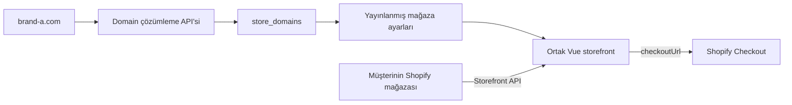
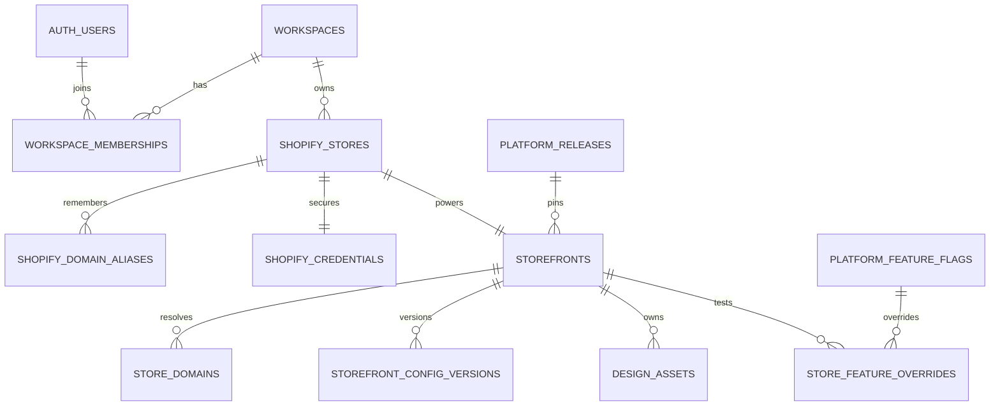

# Çok mağazalı Shopify storefront platformu

## Kesin mimari kararı

Müşterilerin vitrini mevcut **Vue 3 + Vite uygulamasıdır**. Vue tasarımı Liquid'e
çevrilmeyecek. Shopify ürün, koleksiyon, fiyat, stok, sepet, checkout ve sipariş
altyapısı olarak kullanılacaktır.

- **Ortak mağaza vitrini:** Vue 3 + Vite
- **Platform CMS'i:** Vue 3 + Vite
- **Backend API:** Node.js + Fastify
- **Veritabanı ve kullanıcı girişi:** Supabase PostgreSQL + Supabase Auth
- **Ürün ve ticaret verileri:** Shopify
- **Logo ve banner dosyaları:** Platform object storage
- **Mağazaya özel görünüm:** Yayınlanmış CMS ayarları
- **Bütün mağazalara giden geliştirmeler:** Tek ortak Vue sürümü

## Kod deposu yapısı

```text
apps/
  storefront/   Ortak müşteri vitrini; her domain aynı build'i kullanır
  platform/     Kullanıcı hesabı, onboarding ve mağazaya özel CMS
  api/          Supabase, Shopify OAuth/webhook ve public runtime API
legacy/cms/     Aktif olmayan eski tek-mağaza admin ekranları
shopify-theme/  Aktif olmayan Liquid prototipi
```

Bu üç uygulama aynı Git deposunda durur fakat production'da ayrı servisler olarak
yayınlanır. Böylece storefront güncellemesi bütün mağazalara giderken CMS ve backend
bağımsız olarak ölçeklenebilir.

## Bir mağaza isteğinin çalışma şekli



Backend domaini kullanarak yalnızca hangi storefront kaydının okunacağını bulur.
Shopify mağazasının kalıcı sistem kimliği yine `Shop.id` değeridir. Özel domain,
Shopify mağaza kimliğinin yerine geçmez.

## Domain sorumluluğu

Headless kararı nedeniyle alıcıların gördüğü domain bizim barındırdığımız Vue
uygulamasına yönlenir. Bu nedenle platform ileride şu işlemleri otomatikleştirecektir:

- domain kaydını mağazaya bağlama,
- DNS doğrulama yönergeleri,
- TLS/SSL sertifikası,
- domain durum kontrolü,
- `www` ve kök domain yönlendirmesi.

`*.myshopify.com` adresi Shopify API bağlantısı için tutulur. Eski ve güncel
`myshopify.com` adresleri tedbir amacıyla alias geçmişinde saklanır.

## Veri sahipliği

| Veri | Ana kaynak |
| --- | --- |
| Ürün, varyant, fiyat, stok, koleksiyon | Shopify |
| Sepet ve checkout | Shopify Storefront API |
| Sipariş ve Shopify müşterisi | Shopify |
| Platform kullanıcısı ve ekip üyeliği | Supabase |
| Shopify bağlantısı ve şifreli Admin tokenı | PostgreSQL private schema |
| Domain → mağaza eşleştirmesi | PostgreSQL |
| CMS taslağı, yayınlanmış ayar ve geçmiş | PostgreSQL |
| Logo, banner ve marka dosyaları | Object storage |

Platform veritabanında ürün veya sipariş kopyası tutulmaz. Ürün webhook'ları yalnızca
ileride önbellek temizlemek veya bağlantı durumunu takip etmek için kullanılabilir.

## Mağaza ayarları ile ortak kodun ayrılması

Her mağazanın CMS ayarları ayrıdır:

- marka adı,
- logo,
- izin verilen renkler,
- hero/banner içeriği,
- duyuru metni,
- footer ve sosyal bağlantılar.

CMS değişiklikleri önce `draft`, müşteri Yayınla dediğinde `published` olur. Vue
storefront yalnızca `published` kaydı okur.

Yeni ürün galerisi, performans iyileştirmesi veya yeni bir CMS alanı gibi geliştirmeler
tek Vue kod tabanına eklenir. Ortak sürüm yayınlandığında bütün mağazalar yeni kodu
kullanır; mağazaların kendi yayınlanmış ayarları korunur. Beta testleri için feature flag
ve mağaza bazlı override tabloları vardır.

## Veritabanı modeli

Kaynak dosya:
`apps/api/server/db/migrations/0001_multi_tenant_foundation.sql`



## Public runtime endpoint'i

`GET /api/storefront/config`

Endpoint, isteğin hostname değerinden mağazayı bulur ve Vue'ya yalnızca şunları döner:

- public storefront kimliği ve yerelleştirme bilgileri,
- güncel Shopify `myshopify.com` API domaini,
- public Storefront API tokenı,
- yayınlanmış tasarım ayarları,
- aktif sürüm ve feature flag değerleri.

Admin API tokenı, workspace bilgisi, taslak ayarlar ve başka mağazaların verileri hiçbir
zaman bu public yanıta eklenmez.

Yerel geliştirmede `VITE_STOREFRONT_HOST=glowfield.co` ile domain taklit edilebilir.
Production ortamında query-string ile host değiştirme kapalıdır.

## Güvenlik kuralları

- Admin API tokenı yalnızca backend tarafından erişilen `private` şemada şifreli tutulur.
- Kullanıcı CMS erişimi oturum + workspace üyeliğiyle doğrulanır.
- PostgreSQL tablolarında Row Level Security açıktır.
- Public endpoint yalnızca aktif domain, aktif storefront ve yayınlanmış ayar döndürür.
- Domain girdisi normalize edilir ve SQL sorgusu parametreli çalışır.
- CMS renkleri yalnızca önceden izin verilen CSS değişkenlerine uygulanır.
- Shopify ürün ve siparişleri gereksiz yere platform veritabanına alınmaz.

## Eski Liquid tema klasörü

`shopify-theme/` önceki mimari karar sırasında hazırlanmış prototiptir. Aktif ürün
mimarisinin parçası değildir ve yalnızca geçmiş çalışma/fallback referansı olarak
tutulmaktadır.
